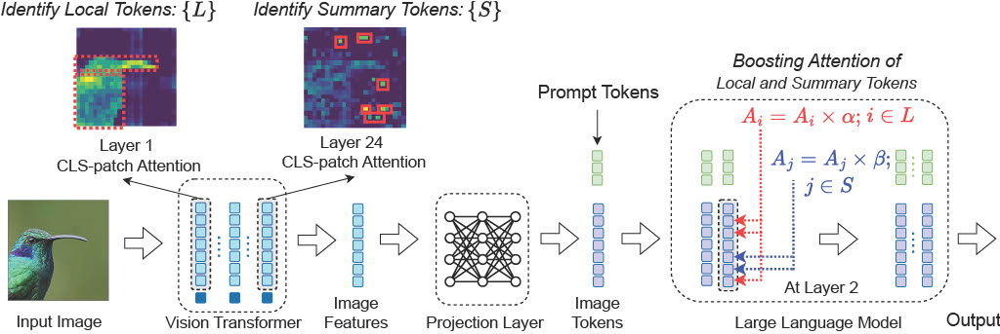

###  **PAINT** (**P**aying **A**ttention to **IN**formed **T**okens)

Paper: [PAINT: PAYING ATTENTION TO INFORMED TOKENS TO MITIGATE HALLUCINATION IN LARGE VISION-LANGUAGE MODEL](https://arxiv.org/abs/2501.12206)

**Abstract:** Large Vision Language Models (LVLMs) have demonstrated remarkable capabilities in understanding and describing visual content, achieving state-of-the-art performance across various vision-language tasks. However, these models often generate descriptions containing objects or details that are absent in the input image, a phenomenon commonly known as hallucination. Our work investigates the key reasons behind this issue by analyzing the attention patterns of tokens across transformer layers and heads. We find that hallucinations often arise from the progressive weakening of attention to visual tokens in the deeper layers of the LLM. Some previous works naively boost the attention of all visual tokens to mitigate this issue, resulting in suboptimal hallucination reduction. To address this, we identify two critical sets of visual tokens that facilitate the transfer of visual information from the vision encoder to the LLM. Local tokens encode grounded information about objects present in an image, while summary tokens capture the overall aggregated representation of the image. Importantly, these two sets of tokens require different levels of attention enhancement. To this end, we propose **PAINT** (**P**aying **A**ttention to **IN**formed **T**okens), a plug-and-play framework that intervenes in the self-attention mechanism of the LLM, selectively boosting the attention of local and summary tokens with learned margins. Extensive experiments on the MSCOCO dataset demonstrate that our approach reduces hallucination rates by up to 62.3\% compared to baseline models while maintaining strong task performance. 

<div align="center">
    
</div>

### Installation and Setup

```bash
conda env create -f modPAI/environment.yml
conda activate modpai
```

### 📌 Important Note

This short paper was initially written as part of a graduate course project at Virginia Tech. Later, the paper was accepted at the [CVPR TMM-OpenWorld 2025 Workshop](https://cvpr25workshop.netlify.app/). However, due to funding limitations, the authors were unable to register, and as a result, the paper did not appear in the official CVPR proceedings.

However, it's paper is available on [arXiv](https://arxiv.org/abs/2501.12206). If you find this paper or the code helpful in your research, please consider citing it using the following BibTeX entry:

```bibtex
@misc{arif2025paintpayingattentioninformed,
  title={PAINT: Paying Attention to INformed Tokens to Mitigate Hallucination in Large Vision-Language Model}, 
  author={Kazi Hasan Ibn Arif and Sajib Acharjee Dip and Khizar Hussain and Lang Zhang and Chris Thomas},
  year={2025},
  eprint={2501.12206},
  archivePrefix={arXiv},
  primaryClass={cs.CV},
  url={https://arxiv.org/abs/2501.12206}, 
}
